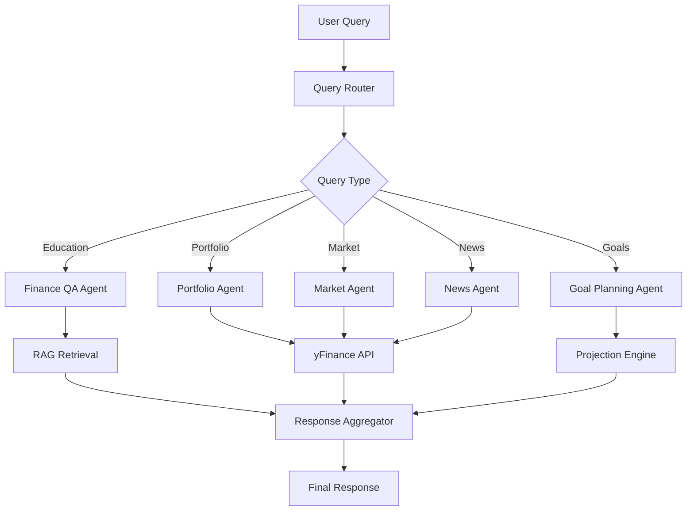
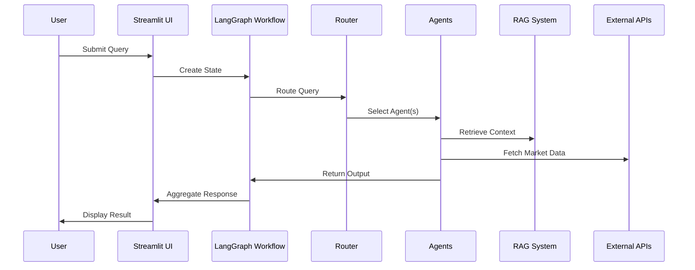

# AI Finance Assistant

A multi-agent conversational AI system for financial education, built with LangGraph workflow orchestration and RAG-based knowledge retrieval.

## Overview

The AI Finance Assistant democratizes financial literacy by providing intelligent, personalized guidance through a conversational interface. It leverages multiple specialized agents to handle diverse financial queries, from basic education to portfolio analysis.

## Architecture

```
+------------------+     +-------------------+     +------------------+
|   Streamlit UI   | --> |   LangGraph       | --> |   Specialized    |
|   (4 Tabs)       |     |   Orchestrator    |     |   Agents (5)     |
+------------------+     +-------------------+     +------------------+
        |                        |                        |
        v                        v                        v
+------------------+     +-------------------+     +------------------+
|   Session State  |     |   Query Router    |     |   RAG System     |
|   Management     |     |   (Conditional)   |     |   (FAISS)        |
+------------------+     +-------------------+     +------------------+
```

### Agent Architecture



### Data Flow



## Features

### 1. Finance Q&A Agent (RAG-based)
- Answers educational questions about investing, financial planning, and market concepts
- Uses FAISS vector store with 20+ curated financial education articles
- Retrieves relevant context and generates accurate responses

### 2. Portfolio Analysis Agent
- Analyzes uploaded CSV portfolios
- Calculates metrics: total value, allocation, returns, diversification
- Provides personalized recommendations

### 3. Market Analysis Agent
- Real-time stock prices via yFinance
- Market summary (S&P 500, Dow, NASDAQ, Russell 2000)
- Historical data and trends

### 4. Goal Planning Agent
- Financial projection calculations
- Retirement planning with compound interest
- Required contribution analysis
- Goal tracking and progress visualization

### 5. News Synthesizer Agent
- Latest financial news aggregation
- Topic-based news filtering
- Market sentiment summaries

## Tech Stack

| Component | Technology |
|-----------|------------|
| LLM | OpenAI GPT-4o-mini |
| Orchestration | LangGraph |
| Vector Store | FAISS |
| Embeddings | sentence-transformers (all-MiniLM-L6-v2) |
| Market Data | yFinance |
| Web UI | Streamlit |
| Testing | pytest |

## Project Structure

```
ai_finance_assistant/
├── src/
│   ├── agents/              # Specialized agent implementations
│   │   ├── base_agent.py
│   │   ├── finance_qa_agent.py
│   │   ├── portfolio_agent.py
│   │   ├── market_agent.py
│   │   ├── goal_planning_agent.py
│   │   └── news_agent.py
│   ├── core/                # Core infrastructure
│   │   ├── config.py        # Configuration management
│   │   ├── llm.py           # LLM integration & prompts
│   │   └── state.py         # LangGraph state definitions
│   ├── rag/                 # RAG system
│   │   ├── embeddings.py    # Embedding manager
│   │   ├── document_processor.py
│   │   ├── vector_store.py  # FAISS index management
│   │   └── retriever.py     # RAG chain implementation
│   ├── workflow/            # LangGraph orchestration
│   │   ├── router.py        # Query routing logic
│   │   └── graph.py         # StateGraph workflow
│   ├── web_app/             # Streamlit interface
│   │   └── app.py
│   ├── utils/               # Utilities
│   │   └── market_data.py   # yFinance wrapper
│   └── data/
│       └── knowledge_base/  # 20 financial education articles
├── tests/
│   ├── unit/                # Unit tests
│   └── integration/         # Integration tests
├── scripts/
│   └── init_rag.py          # RAG initialization script
├── requirements.txt
├── config.yaml
└── run.py                   # Main entry point
```

## Installation

### 1. Clone and Setup

```bash
cd ai_finance_assistant
python -m venv venv
source venv/bin/activate  # On Windows: venv\Scripts\activate
pip install -r requirements.txt
```

### 2. Configure Environment

```bash
cp .env.example .env
# Edit .env and add your OpenAI API key:
# OPENAI_API_KEY=your-actual-api-key
```

### 3. Initialize RAG Index

```bash
python scripts/init_rag.py
```

This creates the FAISS index from the knowledge base documents.

### 4. Run the Application

```bash
python run.py
```

Or directly with Streamlit:

```bash
streamlit run src/web_app/app.py
```

## Usage

### Chat Tab
Ask any financial question:
- "What are stocks and how do they work?"
- "Explain the difference between traditional and Roth IRA"
- "What is dollar-cost averaging?"

### Portfolio Tab
1. Upload a CSV file with columns: `ticker, shares, purchase_price`
2. View portfolio metrics and allocation
3. Ask questions about your portfolio

### Market Tab
- View real-time market indices
- Look up individual stock prices
- Check historical performance

### Goals Tab
1. Add financial goals (retirement, house, education)
2. Track progress toward goals
3. Calculate required contributions

## Testing

Run the test suite:

```bash
# Run all tests
pytest

# Run with coverage
pytest --cov=src --cov-report=html

# Run specific test file
pytest tests/unit/test_core.py

# Run integration tests
pytest tests/integration/
```

## Configuration

### config.yaml

```yaml
app:
  name: "AI Finance Assistant"
  version: "1.0.0"
  debug: false

llm:
  provider: "openai"
  model: "gpt-4o-mini"
  temperature: 0.7
  max_tokens: 2000

rag:
  chunk_size: 1000
  chunk_overlap: 200
  top_k: 5
  similarity_threshold: 0.7

embedding:
  model: "all-MiniLM-L6-v2"
```

## Deployment

### HuggingFace Spaces

1. Create a new Space on HuggingFace
2. Select "Streamlit" as the SDK
3. Upload project files
4. Set `OPENAI_API_KEY` in Space secrets
5. The app will auto-deploy

### Local Docker

```dockerfile
FROM python:3.11-slim
WORKDIR /app
COPY requirements.txt .
RUN pip install -r requirements.txt
COPY . .
RUN python scripts/init_rag.py
EXPOSE 8501
CMD ["streamlit", "run", "src/web_app/app.py"]
```

## Sample Portfolio CSV

```csv
ticker,shares,purchase_price,purchase_date
AAPL,10,150.00,2023-01-15
MSFT,5,280.00,2023-02-20
VTI,20,200.00,2023-03-10
BND,30,75.00,2023-04-01
```

## Demo Scenario

1. **Ask about RSUs**: "I just got RSUs from my tech company. Can you explain how RSUs work and how they're taxed?"

2. **Upload Portfolio**: Upload CSV with tech stocks (AAPL, GOOGL, MSFT, etc.)

3. **Analyze**: "Given my RSU vesting schedule and current portfolio, how concentrated am I in tech? What diversification strategies should I consider?"

4. **Set Goal**: Add retirement goal: $1M in 25 years, starting with $50K

5. **Plan**: "What monthly contribution would I need to reach my retirement goal assuming 7% annual returns?"

## API Reference

### FinanceAssistantWorkflow

```python
from src.workflow.graph import FinanceAssistantWorkflow

workflow = FinanceAssistantWorkflow()
result = workflow.run(
    query="What are stocks?",
    portfolio={"holdings": [...]},  # Optional
    goals=[...],  # Optional
    session_id="unique-session-id"
)
```

### Individual Agents

```python
from src.agents import get_agent
from src.core.state import create_initial_state

agent = get_agent("finance_qa")
state = create_initial_state("What are bonds?")
result = agent.process(state)
```

## Contributing

1. Fork the repository
2. Create a feature branch
3. Add tests for new functionality
4. Ensure all tests pass
5. Submit a pull request

## License

MIT License

## Acknowledgments

- Interview Kickstart - Applied Agentic AI for SWEs course
- LangChain/LangGraph team
- OpenAI
- yFinance contributors
