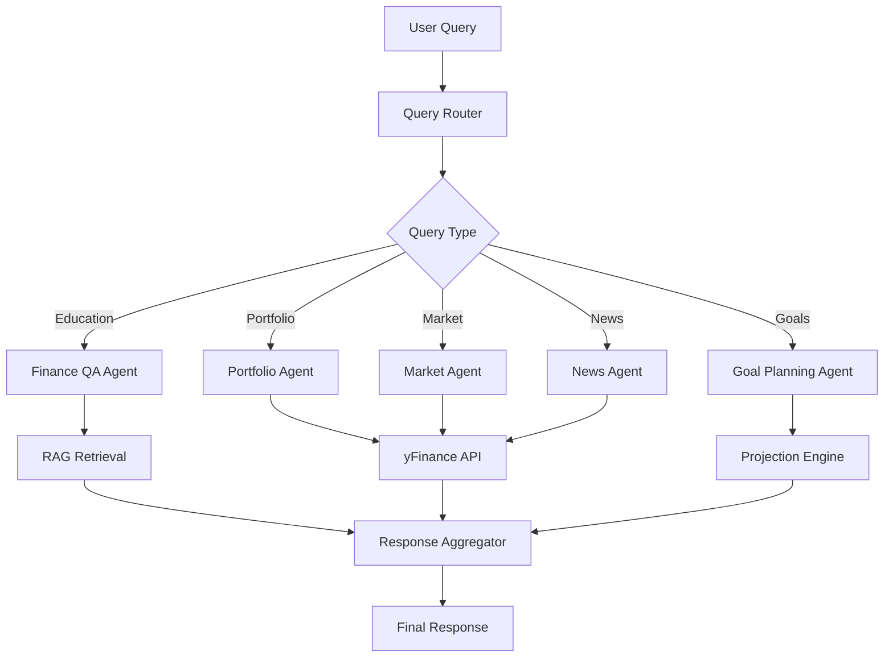
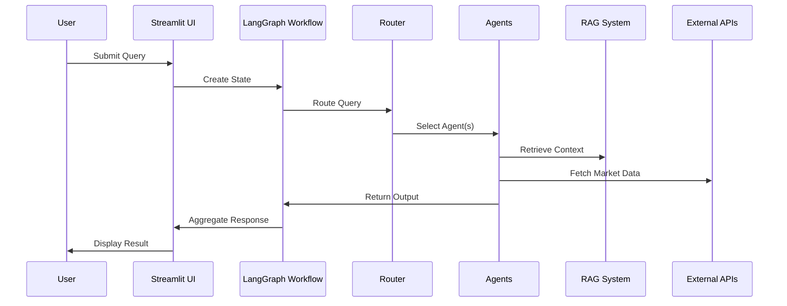

# AI Finance Assistant

A multi-agent conversational AI system for financial education, built with LangGraph workflow orchestration and RAG-based knowledge retrieval.

## 🚀 Quick Start

**With Docker (Recommended):**
```bash
echo "OPENAI_API_KEY=your_key_here" > .env
docker-compose up -d
```
Access at `http://localhost:8502` • See [Docker Setup](#running-with-docker-) for details

**Local Installation:**
```bash
python -m venv venv && source venv/bin/activate
pip install -r requirements.txt
python scripts/init_rag.py
python run.py
```
Access at `http://localhost:8501` • See [Local Setup](#running-locally) for details

## Overview

The AI Finance Assistant democratizes financial literacy by providing intelligent, personalized guidance through a conversational interface. It leverages multiple specialized agents to handle diverse financial queries, from basic education to portfolio analysis.

## Architecture

```
+------------------+     +-------------------+     +------------------+
|   Streamlit UI   | --> |   LangGraph       | --> |   Specialized    |
|   (4 Tabs)       |     |   Orchestrator    |     |   Agents (5)     |
+------------------+     +-------------------+     +------------------+
        |                        |                        |
        v                        v                        v
+------------------+     +-------------------+     +------------------+
|   Session State  |     |   Query Router    |     |   RAG System     |
|   Management     |     |   (Conditional)   |     |   (FAISS)        |
+------------------+     +-------------------+     +------------------+
```

### Agent Architecture



### Data Flow



## Features

### 🤖 Smart Tab Switching (NEW!)
- **Context-aware navigation**: Automatically switches to the relevant tab based on your question
- **Data pre-loading**: Ticker symbols, amounts, and other data extracted from your query
- **Seamless UX**: Ask about Apple stock in chat, get detailed AAPL info in the Market tab
- See [SMART_TAB_SWITCHING.md](docs/SMART_TAB_SWITCHING.md) for details

### 1. Finance Q&A Agent (RAG-based)
- Answers educational questions about investing, financial planning, and market concepts
- Uses FAISS vector store with 20+ curated financial education articles
- Retrieves relevant context and generates accurate responses

### 2. Portfolio Analysis Agent
- Analyzes uploaded CSV portfolios
- Calculates metrics: total value, allocation, returns, diversification
- Provides personalized recommendations

### 3. Market Analysis Agent
- Real-time stock prices via yFinance
- Market summary (S&P 500, Dow, NASDAQ, Russell 2000)
- Historical data and trends

### 4. Goal Planning Agent
- Financial projection calculations
- Retirement planning with compound interest
- Required contribution analysis
- Goal tracking and progress visualization

### 5. News Synthesizer Agent
- Latest financial news aggregation
- Topic-based news filtering
- Market sentiment summaries

## Tech Stack

| Component | Technology |
|-----------|------------|
| LLM | OpenAI GPT-4o-mini |
| Orchestration | LangGraph |
| Vector Store | FAISS |
| Embeddings | sentence-transformers (all-MiniLM-L6-v2) |
| Market Data | yFinance |
| Web UI | Streamlit |
| Testing | pytest |

## Project Structure

```
ai_finance_assistant/
├── src/
│   ├── agents/              # Specialized agent implementations
│   │   ├── base_agent.py
│   │   ├── finance_qa_agent.py
│   │   ├── portfolio_agent.py
│   │   ├── market_agent.py
│   │   ├── goal_planning_agent.py
│   │   └── news_agent.py
│   ├── core/                # Core infrastructure
│   │   ├── config.py        # Configuration management
│   │   ├── llm.py           # LLM integration & prompts
│   │   └── state.py         # LangGraph state definitions
│   ├── rag/                 # RAG system
│   │   ├── embeddings.py    # Embedding manager
│   │   ├── document_processor.py
│   │   ├── vector_store.py  # FAISS index management
│   │   └── retriever.py     # RAG chain implementation
│   ├── workflow/            # LangGraph orchestration
│   │   ├── router.py        # Query routing logic
│   │   └── graph.py         # StateGraph workflow
│   ├── web_app/             # Streamlit interface
│   │   └── app.py
│   ├── utils/               # Utilities
│   │   └── market_data.py   # yFinance wrapper
│   └── data/
│       └── knowledge_base/  # 20 financial education articles
├── tests/
│   ├── unit/                # Unit tests
│   └── integration/         # Integration tests
├── scripts/
│   └── init_rag.py          # RAG initialization script
├── requirements.txt
├── config.yaml
└── run.py                   # Main entry point
```

## Running Locally

### Prerequisites

Before you begin, ensure you have the following installed:

- **Python 3.11+** (recommended: Python 3.11 or 3.12)
  - Check version: `python --version` or `python3 --version`
- **pip** (Python package manager)
- **Git** (to clone the repository)
- **OpenAI API Key** - Get one from [OpenAI Platform](https://platform.openai.com/api-keys)
  - Note: This application uses GPT-4o-mini which requires API credits

### Step 1: Clone the Repository

```bash
git clone https://github.com/pushkarbh/ai_finance_assistant.git
cd ai_finance_assistant
```

### Step 2: Create Virtual Environment

```bash
# Create virtual environment
python -m venv venv

# Activate virtual environment
# On macOS/Linux:
source venv/bin/activate

# On Windows:
venv\Scripts\activate
```

You should see `(venv)` prefix in your terminal when activated.

### Step 3: Install Dependencies

```bash
pip install -r requirements.txt
```

This installs all required packages including:
- LangChain & LangGraph (orchestration)
- OpenAI SDK (LLM integration)
- FAISS (vector store)
- Sentence Transformers (embeddings)
- yFinance (market data)
- Streamlit (web UI)
- pytest (testing)

### Step 4: Configure Environment Variables

```bash
# Copy the example environment file
cp .env.example .env

# Open .env in your text editor and add your OpenAI API key
# Example using nano:
nano .env
```

Your `.env` file should contain:
```env
OPENAI_API_KEY=sk-your-actual-openai-api-key-here
```

**Important:** Never commit your `.env` file to version control. It's already included in `.gitignore`.

### Step 5: Initialize the RAG System

Before running the application, you need to build the FAISS vector index from the knowledge base:

```bash
python scripts/init_rag.py
```

This script:
- Loads 20+ financial education documents from `src/data/knowledge_base/`
- Generates embeddings using sentence-transformers
- Creates a FAISS index stored in `src/data/faiss_index/`
- Takes ~30-60 seconds on first run

Expected output:
```
Processing documents from knowledge base...
Created 45 chunks from 20 documents
Generating embeddings...
FAISS index created successfully with 45 vectors
Index saved to: src/data/faiss_index/
```

### Step 6: Run the Application

You have several options to start the application:

**Option A: Using the run script (recommended)**
```bash
python run.py
```

**Option B: Direct Streamlit command (simple)**
```bash
streamlit run src/web_app/app.py
```

**Option C: Local testing with custom port (recommended for development)**
```bash
source venv/bin/activate && streamlit run src/web_app/app.py --server.port 8502 --server.address 0.0.0.0
```
Use this for local testing and development. Runs on port 8502 and accessible from other devices on your network.

**Option D: HuggingFace Spaces compatible (for testing deployment locally)**
```bash
source venv/bin/activate && streamlit run src/web_app/app.py --server.port 7860 --server.address 0.0.0.0
```

**Option E: Streamlit Cloud compatible (root-level entry point)**
```bash
streamlit run app.py
```

### Step 7: Access the Application

Once the application starts, you should see:

```
You can now view your Streamlit app in your browser.

Local URL: http://localhost:8501  (or 8502 if you specified that port)
Network URL: http://192.168.x.x:8501  (or 8502)
```

**Default ports by run option:**
- Options A, B, E: `http://localhost:8501`
- Option C: `http://localhost:8502`
- Option D: `http://localhost:7860`

### Verifying the Setup

Test each component to ensure everything works:

1. **Chat Tab**: Ask "What are stocks?" - should get a detailed answer from the RAG system
2. **Portfolio Tab**: Upload the sample CSV below or create your own
3. **Market Tab**: Search for "AAPL" - should show current Apple stock price
4. **Goals Tab**: Add a test goal to verify calculations work

### Troubleshooting

**Issue: `ModuleNotFoundError`**
```bash
# Ensure virtual environment is activated
source venv/bin/activate  # or venv\Scripts\activate on Windows

# Reinstall dependencies
pip install -r requirements.txt
```

**Issue: `OpenAI API Error: Invalid API Key`**
- Verify your API key is correct in `.env`
- Check you have credits in your OpenAI account
- Ensure no extra spaces or quotes in the `.env` file

**Issue: `FAISS index not found`**
```bash
# Regenerate the index
python scripts/init_rag.py
```

**Issue: Port 8501 already in use**
```bash
# Run on a different port
streamlit run src/web_app/app.py --server.port 8502
```

**Issue: Market data not loading**
- yFinance sometimes has rate limits
- Check your internet connection
- Wait a few seconds and retry

### Running Tests (Optional)

Verify your setup with the test suite:

```bash
# Run all tests
pytest

# Run with verbose output
pytest -v

# Run specific test category
pytest tests/unit/
pytest tests/integration/

# Run with coverage report
pytest --cov=src --cov-report=html
```

### Stopping the Application

- Press `Ctrl+C` in the terminal where Streamlit is running
- Deactivate virtual environment: `deactivate`

## Running with Docker 🐳

Docker provides an isolated, reproducible environment that works consistently across all platforms.

### Prerequisites

- **Docker** installed ([Get Docker](https://docs.docker.com/get-docker/))
- **Docker Compose** (included with Docker Desktop)
- **OpenAI API Key**

### Quick Start with Docker Compose (Recommended)

The easiest way to run the application:

```bash
# 1. Clone the repository (if you haven't already)
git clone https://github.com/pushkarbh/ai_finance_assistant.git
cd ai_finance_assistant

# 2. Create .env file with your OpenAI API key
echo "OPENAI_API_KEY=your_openai_api_key_here" > .env

# 3. Build and start the container
docker-compose up -d

# 4. View logs (optional)
docker-compose logs -f

# 5. Stop the container
docker-compose down
```

**Access the app at:** `http://localhost:8502`

### Using Docker Directly

If you prefer not to use Docker Compose:

```bash
# Build the image
docker build -t ai-finance-assistant .

# Run the container
docker run -d \
  --name ai-finance-assistant \
  -p 8502:8502 \
  -e OPENAI_API_KEY=your_api_key_here \
  -v $(pwd)/src/data:/app/src/data \
  ai-finance-assistant

# View logs
docker logs -f ai-finance-assistant

# Stop and remove
docker stop ai-finance-assistant
docker rm ai-finance-assistant
```

### Docker Features

✅ **No Python installation required** - Everything runs in the container  
✅ **Consistent environment** - Works the same on macOS, Linux, and Windows  
✅ **Easy updates** - Just rebuild the image  
✅ **Production-ready** - Includes health checks and resource limits  
✅ **Data persistence** - FAISS index and knowledge base are persisted  

### Docker Troubleshooting

**Container won't start:**
```bash
# Check logs
docker-compose logs

# Common fix: rebuild
docker-compose up --build
```

**Port already in use:**
```bash
# Change port in docker-compose.yml
ports:
  - "8503:8502"  # Use 8503 instead
```

**OPENAI_API_KEY not set:**
```bash
# Verify .env file exists and contains your key
cat .env

# Or pass directly
docker run -e OPENAI_API_KEY=sk-your-key ...
```

For comprehensive Docker documentation including cloud deployment, see [DOCKER.md](DOCKER.md).

## Usage

### 🚀 Smart Tab Switching (Quick Start)

The app now features intelligent navigation! Just ask questions naturally:

**Market Questions:**
- "How is Apple doing?" → Automatically suggests Market tab with AAPL loaded
- "What's Tesla stock price?" → Market tab with TSLA ready
- "$MSFT analysis" → Market tab with Microsoft data

**Portfolio Questions:**
- "Analyze my portfolio" → Portfolio tab with full analysis
- "Is my portfolio diversified?" → Portfolio insights ready

**Goal Planning:**
- "Save $50K for a house" → Goals tab with $50,000 pre-filled
- "Retire with $1M in 20 years" → Goals calculator ready

**📖 See detailed examples:** [docs/USAGE_EXAMPLES.md](docs/USAGE_EXAMPLES.md)

### Chat Tab
Ask any financial question:
- "What are stocks and how do they work?"
- "Explain the difference between traditional and Roth IRA"
- "What is dollar-cost averaging?"

The AI will answer and guide you to the relevant tab when appropriate.

### Portfolio Tab
1. Upload a CSV file with columns: `ticker, shares, purchase_price`
2. View portfolio metrics and allocation
3. Ask questions about your portfolio in Chat

### Market Tab
- View real-time market indices
- Look up individual stock prices (or ask in Chat!)
- Check historical performance

### Goals Tab
1. Add financial goals (retirement, house, education)
2. Track progress toward goals
3. Calculate required contributions (or ask in Chat!)

### 📚 Documentation
- **[Smart Tab Switching Guide](docs/SMART_TAB_SWITCHING.md)** - Technical details
- **[Usage Examples](docs/USAGE_EXAMPLES.md)** - Step-by-step workflows
- **[Visual Flow](docs/VISUAL_FLOW.md)** - Diagrams and flowcharts
- **[Implementation Summary](docs/IMPLEMENTATION_SUMMARY.md)** - Complete feature overview

## Testing

Run the test suite:

```bash
# Run all tests
pytest

# Run with coverage
pytest --cov=src --cov-report=html

# Run specific test file
pytest tests/unit/test_core.py

# Run integration tests
pytest tests/integration/
```

## Configuration

### config.yaml

```yaml
app:
  name: "AI Finance Assistant"
  version: "1.0.0"
  debug: false

llm:
  provider: "openai"
  model: "gpt-4o-mini"
  temperature: 0.7
  max_tokens: 2000

rag:
  chunk_size: 1000
  chunk_overlap: 200
  top_k: 5
  similarity_threshold: 0.7

embedding:
  model: "all-MiniLM-L6-v2"
```

## Deployment

### HuggingFace Spaces

1. Create a new Space on HuggingFace
2. Select "Streamlit" as the SDK
3. Upload project files
4. Set `OPENAI_API_KEY` in Space secrets
5. The app will auto-deploy

### Local Docker

```dockerfile
FROM python:3.11-slim
WORKDIR /app
COPY requirements.txt .
RUN pip install -r requirements.txt
COPY . .
RUN python scripts/init_rag.py
EXPOSE 8501
CMD ["streamlit", "run", "src/web_app/app.py"]
```

## Sample Portfolio CSV

```csv
ticker,shares,purchase_price,purchase_date
AAPL,10,150.00,2023-01-15
MSFT,5,280.00,2023-02-20
VTI,20,200.00,2023-03-10
BND,30,75.00,2023-04-01
```

## Demo Scenario

1. **Ask about RSUs**: "I just got RSUs from my tech company. Can you explain how RSUs work and how they're taxed?"

2. **Upload Portfolio**: Upload CSV with tech stocks (AAPL, GOOGL, MSFT, etc.)

3. **Analyze**: "Given my RSU vesting schedule and current portfolio, how concentrated am I in tech? What diversification strategies should I consider?"

4. **Set Goal**: Add retirement goal: $1M in 25 years, starting with $50K

5. **Plan**: "What monthly contribution would I need to reach my retirement goal assuming 7% annual returns?"

## API Reference

### FinanceAssistantWorkflow

```python
from src.workflow.graph import FinanceAssistantWorkflow

workflow = FinanceAssistantWorkflow()
result = workflow.run(
    query="What are stocks?",
    portfolio={"holdings": [...]},  # Optional
    goals=[...],  # Optional
    session_id="unique-session-id"
)
```

### Individual Agents

```python
from src.agents import get_agent
from src.core.state import create_initial_state

agent = get_agent("finance_qa")
state = create_initial_state("What are bonds?")
result = agent.process(state)
```

## Contributing

1. Fork the repository
2. Create a feature branch
3. Add tests for new functionality
4. Ensure all tests pass
5. Submit a pull request

## License

MIT License

## Acknowledgments

- Interview Kickstart - Applied Agentic AI for SWEs course
- LangChain/LangGraph team
- OpenAI
- yFinance contributors
